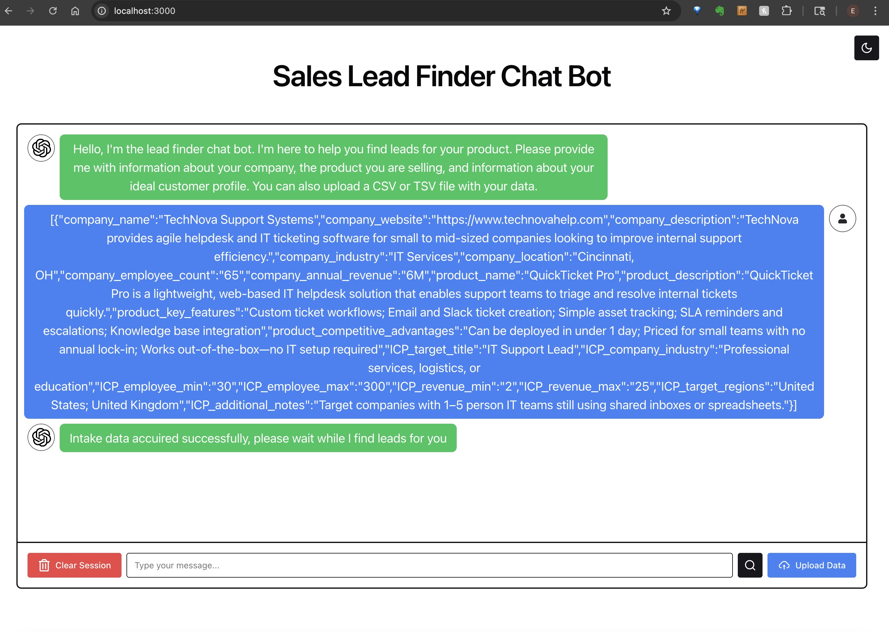
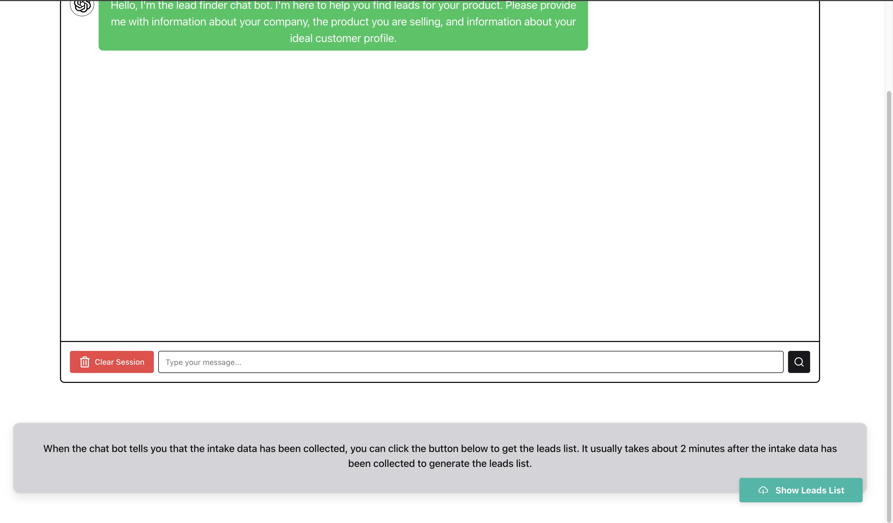
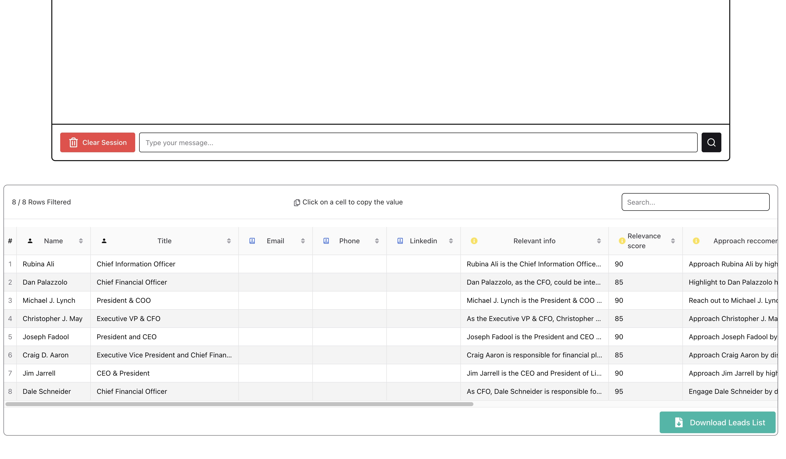

## Overview
Build an AI agent that can search the web to create a list of high quality leads for a product. The user should be able to input the production and the agent should ask the user the necessary background (use AG2 intake agent) and find great leads that would be a good match (use the AG2 web search or deep research agent). Add a nice looking frontend for this agent using React, Chakra, and Express.

### how to run
1. Build frontend
    1. cd /client
    2. `npm i`
    3. `npm run build`
2. Start express-server 
    1. cd /express-server
    2. `npm i`
    3. `node server.js`
3. Add openAI keys
    1. edit /ag2/OAI_CONFI_LIST_sample and rename to OAI_CONFI_LIST
4. Start ag2 agent
    1. cd /ag2
    2. `pip install -U ag2[openai,browser-use]`
    3. `pip install -r requirements.txt`
    4. `playwright install`
    5. `uvicorn main:app --reload`
5. Go to http://localhost:3000/ and chat

### Usage

