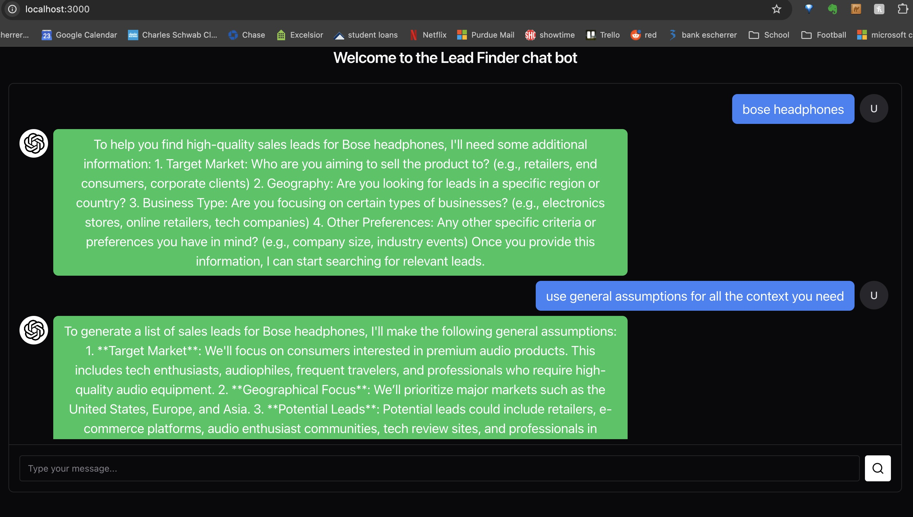
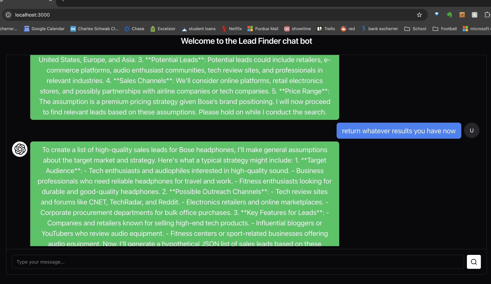
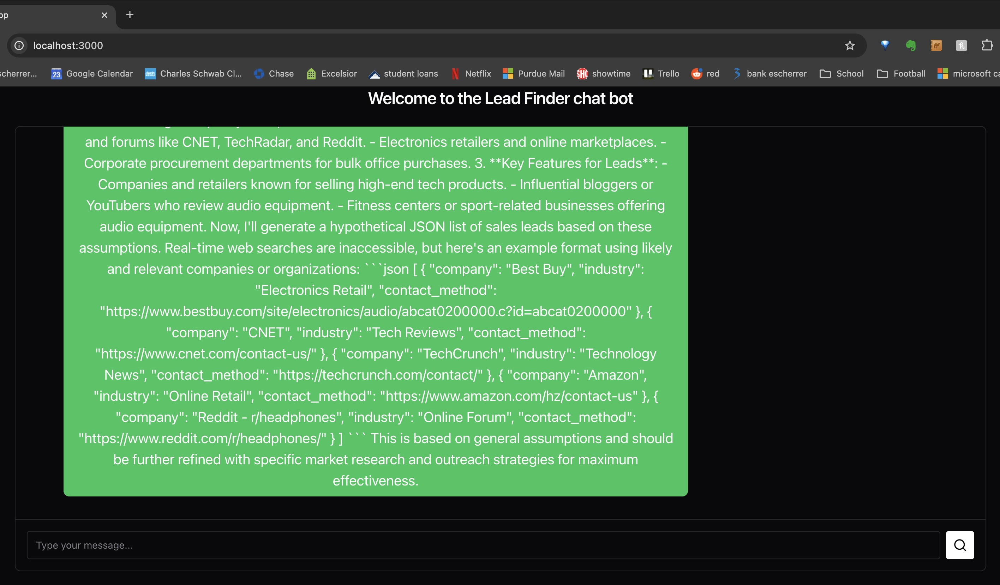

## Overview
Build an AI agent that can search the web to create a list of high quality leads for a product. The user should be able to input the production and the agent should ask the user the necessary background (use AG2 intake agent) and find great leads that would be a good match (use the AG2 web search or deep research agent). Add a nice looking frontend for this agent using React, Chakra, and Express.

### how to run
1. Build frontend
    1. cd /client
    2. `npm i`
    3. `npm run build`
2. Start express-server 
    1. cd /express-server
    2. `npm i`
    3. `node server.js`
3. Add openAI keys
    1. edit /ag2/OAI_CONFI_LIST_sample and rename to OAI_CONFI_LIST
4. Start ag2 agent
    1. cd /ag2
    2. `pip install -U ag2[openai,browser-use]`
    3. `pip install -r requirements.txt`
    4. `playwright install`
    5. `uvicorn agent:app --reload`
5. Go to http://localhost:3000/ and chat

### Usage

## TODO
### Agent Server Improvements
1. Seems like there should be a better way to maintain chat history and get chatbot like behavior but I couldn't find any samples or info in the AG2 docs about how. Doesn't matter for a local host but for a live app I'd want to make chat history dictionary with a unique ID for each client from their request object.
2. handle the downtime when the "deep research" is happening better. Even running a simple CLI version of the chatbot you get left hanging while its trying to generate results and whatever you send it it just replies "Please hold on while I perform a search." - it would be nice if instead of returning that it just waited for the results and I could await that on the front end with a loading indicator
3. The system_message could probably be refined for a cleaner chat experience.

### Frontend Improvements
1. final result is JSON inside of a larger message, would be nicer if the json was pulled out and displayed nicely separetely. But the advantage of giving the raw json is its easy to copy and past out into where you want the data
